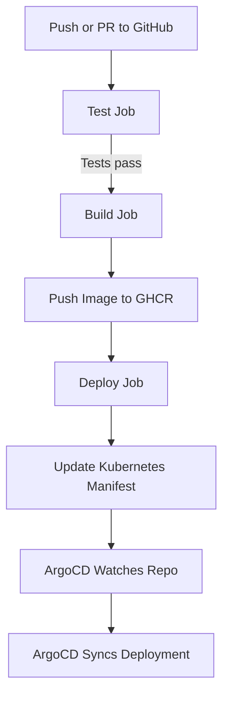

# FastAPI Kubernetes Interview Task

This repository contains a small FastAPI application intended for a technical interview task.

## Technical Task

Imagine this is a production application that needs to be deployed to a Kubernetes cluster.

Your task is to:

- Fork this repository.
- Understand the application code.
- Create a **Dockerfile** to containerise the application.
- Write a **Kubernetes Deployment YAML** file that deploys the application correctly.
- **Implement automated testing** using a CI tool of your choice (e.g., GitHub Actions, GitLab CI, Jenkins), running the tests in the provided `tests.py` script.
- **Build and deploy** the application locally using your preferred Kubernetes environment (e.g., Minikube, Kind).

---

## Resource Requirements

Please assume the following **resource needs** for the container:

| Resource | Recommended Value |
|:---------|:-------------------|
| CPU Request | `100m` |
| CPU Limit | `250m` |
| Memory Request | `128Mi` |
| Memory Limit | `512Mi` |

You are expected to define these in your Deployment YAML.

## Package management

[Pipenv: Python Development Workflow for Humans](https://pipenv.pypa.io/en/latest/)

### Pipenv: Quick Guide

```bash
pip install pipenv
```

Initialize a Project

```bash
pipenv install            # Creates a virtual environment and Pipfile
pipenv install <package>  # Install a package
pipenv install <package> --dev  # Install a dev dependency
```

Regular vs Dev Packages

* Regular packages ([packages]): Required to run the application.
* Dev packages ([dev-packages]): Needed only during development (e.g., testing, linting).

## Local development

```bash
pipenv run test # run tests
pipenv run serve # serve locally
```

### .env for local development example

Example (this file is ignored by git)

```bash
# file .env
ENV="local"
LOG_LEVEL="debug"
DATABASE_URL="sqlite://memory"
TIMEOUT_SECONDS="0"
```

## Local development with Docker

```bash
docker-compose up --build
```

## CI/CD Pipeline Documentation

### Workflow Overview

- **Triggers**:
  - On push to `main` or `dev`, except docs and metadata files.
  - On pull request to `main`, ignoring the same paths.
- **Jobs**:
  - `test`: Runs tests in a clean Python environment using `pipenv`.
  - `build`: Builds and pushes a Docker image to GitHub Container Registry (GHCR).
  - `deploy`: Updates Kubernetes manifests with the new image tag.
- **ArgoCD Integration**:
  - ArgoCD is configured separately and continuously monitors the repository.
  - After the deployment job updates the manifest, ArgoCD detects the change and applies it to the cluster.



### Key Features

* Python Environment: Uses Python 3.13 with dependency caching and pipenv( all versioned and auto-updated with dependabot )

* Containerization: Docker images built with Buildx and pushed to GHCR.

* Immutable Tags: Each image is tagged with the Git commit SHA.

* Manifest Management: Kubernetes YAML updated in-place using yq. ( for simplicity + escape build with ci skip tag )

* GitOps Friendly: Deployment relies on ArgoCD watching the repository state.
